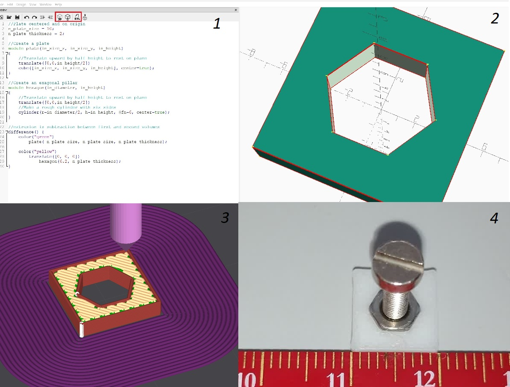

# Learning-OpenSCAD
Within this repo I am documenting my learning or OpenSCAD to generate STLs to print with my 3D Printer

# [Lesson 1 - Basic Shapes](1-Basic_Shapes)
Learning how to create, color and translates basic 3D shapes

  
Click to expand

- only the last variable assignment counts
- functions are transformations and are stopped by semicolon ";"
- $fn controls the number of sides or roughness of a circle
- color is a transformation
- translate is a transformation

# [Lesson 2 - Holes, STL, gcode, 3D print](2-Holes)
Learning how to extrude a 6.2mm hexagonal hole in a plate that can fit a standard M3 nut. Generate an stl, use Creality software to slice it into gcode, 3D print the gcode into a physical model. Test the model.

  
Click to expand

#### Drill an hole and generate an STL

- "difference" transformation can be used to make an extrusion
- "OpenSCAD F5 Preview" does a fast preview
- The preview has artefacts with surface and subtracted survace, it's fine
- "OpenSCAD F6 Render" does a proper render, it fixes artefacts
- "OpenSCAD F7 STL" generates an STL file that can be sliced
- care to redo a render, otherwise the button will stl the previous render

#### Use Creality Print software to slice STL into a gcode

- I'm using a [Creality K1](https://www.creality.com/products/creality-k1-3d-printer)
- drag and drop the stl, place it, slice it and export gcode
- I'm not delving deep in how to slice the stl
- Ideally make models that do not need support
- I like brim to improve adhesion. PEI bed makes adhesion better

#### Use Creality K1 to 3D print the gcode into a physical model

- use USB key to move the gcode into the Creality K1
- 3D print
- Remove the support and test fit M3 nut

# [Lesson 3 - Threads, Bolts and Nuts](3-Threads-Bolts-Nuts)

Learning how to thread a 3D printed part.

Doing M metric threads on 3D printing is challenging, if you need a M thread, think about embedding a M threaded metal insert or nut in your print. Otherwise, do a 3D printed thread with a much wider pitch.

  
Click to expand

* [Thread library](https://github.com/rcolyer/threads-scad) library generates threads
* Make a Bolt by stacking:
  * an hexagon for the nut
  * a cylinder for the grip
  * a thread

* Make a Nut by:
  * a hexagon for the nut
  * extrude a thread

* A Wrench size d=10mm will need an hexagon diameter D=10mm *2 /sqrt(3) =11.55mm

* Remember to make the nut thread ow wider diameter
  * In my experiment the added diameter is 1mm to 1.5mm

